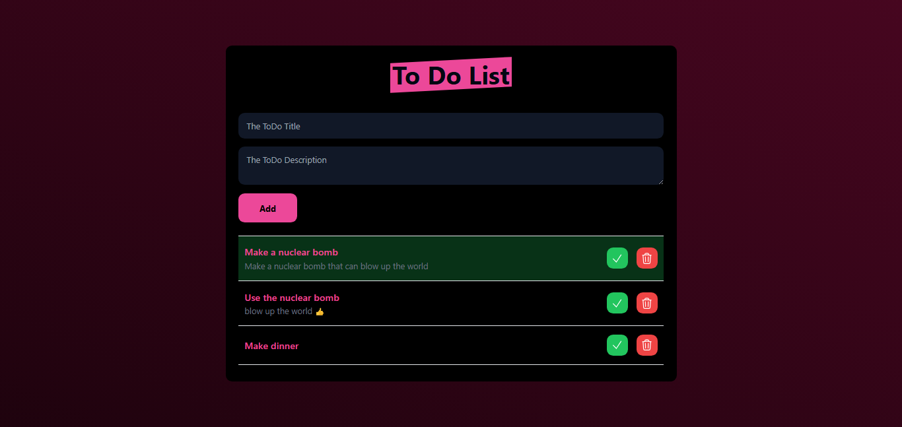

# 📌 Laravel & Tailwind CSS To-Do List

A simple and clean To-Do List application built with **Laravel** and **Tailwind CSS**. 🚀

## 📸 Screenshots
 

## 🎨 Features
✅ Add new tasks  
✅ Mark tasks as completed  
✅ Delete tasks  
✅ Responsive design with Tailwind CSS  

---

## 🏗 Tech Stack
- **Laravel 10** (Backend)
- **Tailwind CSS** (Styling)
- **MySQL / SQLite** (Database)
- **Blade Templates** (Frontend)

---

## 📜 Routes
| Method | URI | Description |
|--------|----------------|-------------|
| GET | `/` | Show all tasks |
| POST | `/tasks` | Add a new task |
| PUT | `/tasks/{id}` | Update a task |
| DELETE | `/tasks/{id}` | Delete a task |

---

## 📌 License
This project is open-source and free to use. 🚀

